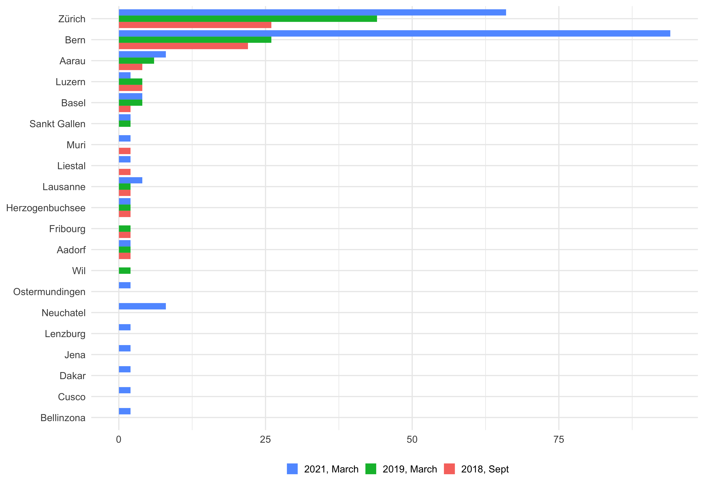
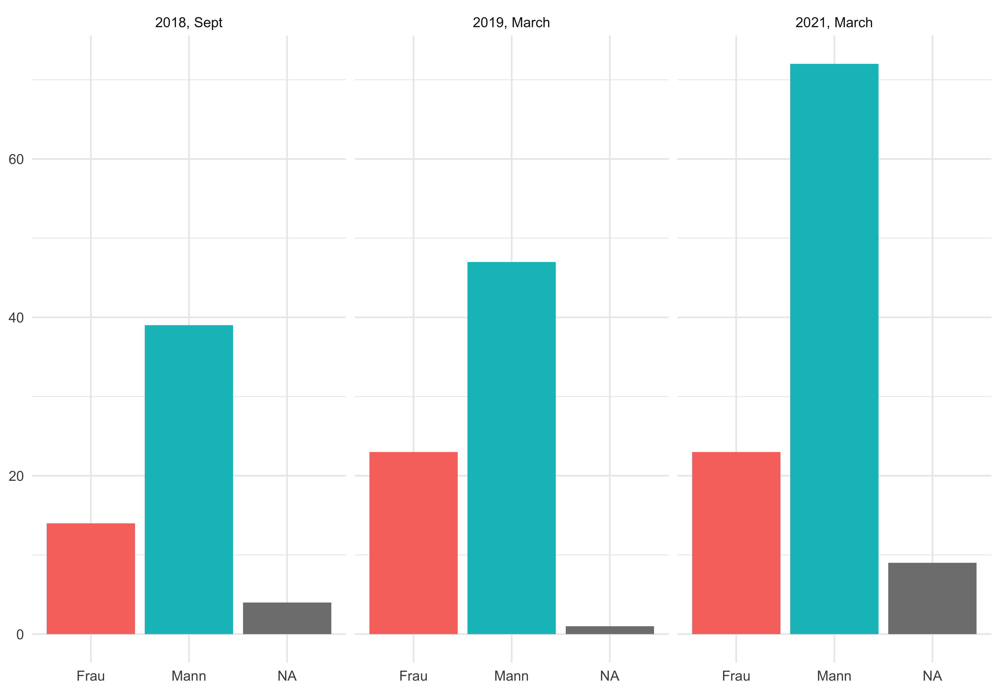

```{r setup, include=FALSE}
options(htmltools.dir.version = FALSE)

source("libs/render_toc.R")
```


# Programm

- <font > <b> adminR</b></font>

- <font > <b> Building ships while weathering a storm, Arrr...R!</b></font> <br />
Damir Perisa and Katrin Schneider, BAG


- <font > <b> Customized RMarkdown templates with indiedown</b></font> <br />
Angelica Becerra Garnica, cynkra

- <font > <b> Break-Out Rooms, Virtual Apéro</b></font>

---

# Break Out Rooms

- <font > <b> BAG</b></font>
moderiert

- <font > <b> Indiedown</b></font>
moderiert

- <font > <b> Bar</b></font>
nicht moderiert 🍻

- <font > <b> Table 1 to 10</b></font>
nicht moderiert


---


# adminR
### Was
- Halbjährliches Treffen irgendwo in der Schweiz oder virtuell, früh abends unter der Woche und informell.

- Möglichkeit zum Austausch mit anderen UseRn in der öffentlichen Verwaltung und verwandten Institutionen.

- Methodische Aspekte stehen im Vordergrund. Wie wird R eingesetzt, für welche Aufgaben, welche Packages, wie sieht der Workflow aus, etc.?


### Wie

- Themenvorträge (20 Min.)
- Lightning Talks (10 Min.): Institutionen stellen vor, wie sie R anwenden

Sprache: frei


---

# adminR

### Wer

Mitarbeitende der Öffentlichen Verwaltung oder verwandten Institutionen, die mit Daten der Öffentlichen Statistik arbeiten und dazu die Software R verwenden.


### Organisationsteam

- Andrea Schnell, Statistisches Amt Kanton Zürich
- Ronald Indergand, Staatssekretariat für Wirtschaft
- Christoph Sax, cynkra GmbH

Das  Organisationsteam sucht Gastgeber und Vortragende. Die Gastgeber stellen den Raum und die Verpflegung zur Verfügung.


---

# Nach Stadt

```{r, echo = FALSE, out.width = "90%"}

```

---

# Nach Geschlecht

```{r, echo = FALSE, out.width = "90%"}

```


---


background-image: url("libs/logo.png")
background-position: 50% 10%
background-size: 30%
class:  bottom, center, inverse

<br>

`r fontawesome::fa("meetup", height = 50)`  https://www.meetup.com/adminr/

`r fontawesome::fa("github", height = 50)`  https://github.com/swiss-adminR

`r fontawesome::fa("twitter", height = 50)`  https://twitter.com/adminR3

<br>

`r fontawesome::fa("envelope", height = 50)`  https://twitter.com/adminR3

[Ronald](mailto:ronald.indergand@seco.admin.ch), [Christoph](mailto:christoph@cynkra.com), [Andrea](mailto:andrea.schnell@statistik.ji.zh.ch)


